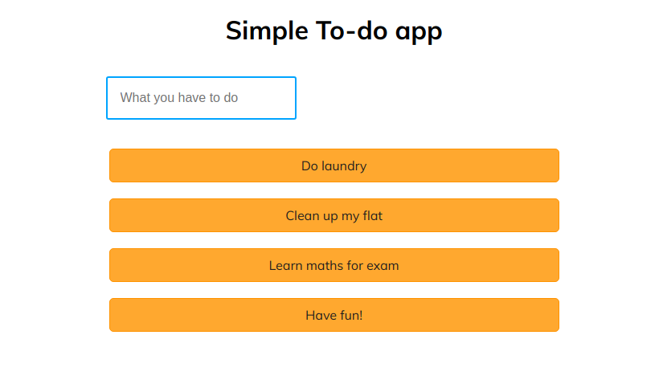

# simple-to-do-app

Just a small fun project of a basic to-do app.

## Screenshot

## Tech Stack

* React
* styled-components
* Jest, Enzyme
* PropTypes

## Available Scripts

Script          | Description 
-----           | -----------
`install`       | Installs packages that project relay on.
`start`         | Runs the app in the development mode.
`test`          | Launches the test runner.
`build`         | Builds the app for production to the `build` folder.